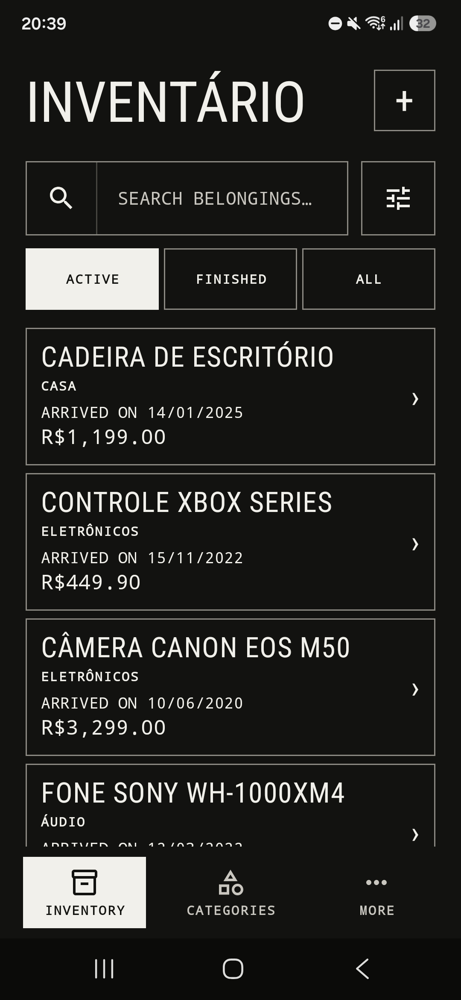
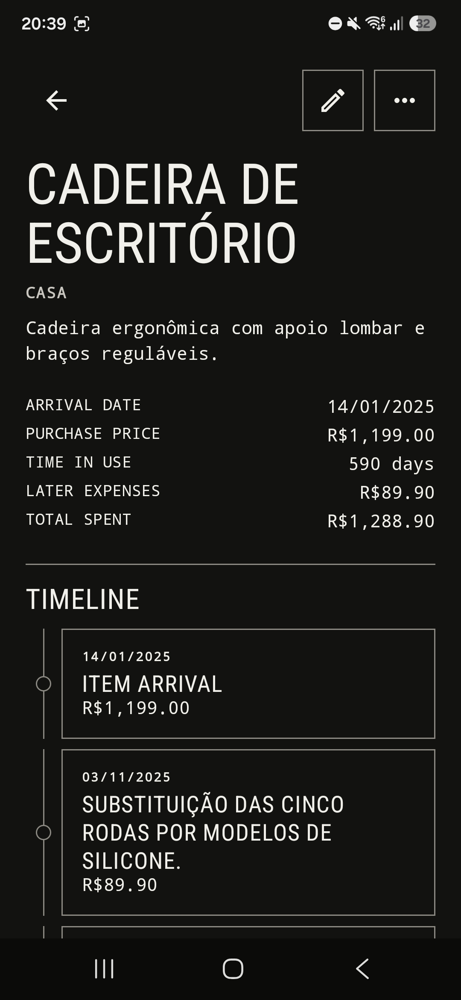
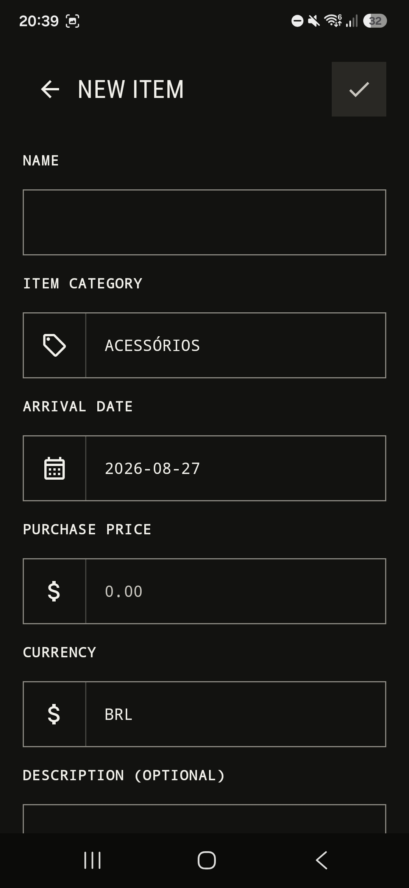
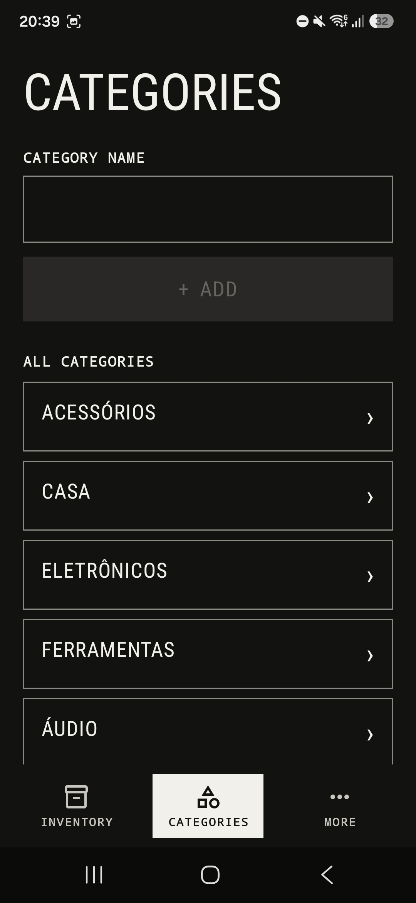

# Inventário

Aplicativo Android para acompanhar seus pertences, os custos de manutenção e todo o ciclo de uso em um só lugar.

O Inventário registra quando cada item chegou, quanto custou e os acontecimentos que fizeram parte de sua história. Manutenções, reparos e outras despesas ficam reunidos em uma linha do tempo, permitindo acompanhar por quanto tempo cada coisa permanece em uso e quanto foi gasto com ela ao longo desse período.

[Baixar a versão mais recente](https://github.com/dhianapereira/inventario/releases/latest)

## O app por dentro

<p align="center">
  
  
  
  
</p>

## Funcionalidades

- Cadastro, edição, exclusão, busca e filtragem de itens.
- Categorias personalizadas para organizar os pertences.
- Registro da data de chegada, valor pago, moeda e descrição de cada item.
- Cálculo automático do tempo de uso e do custo total.
- Linha do tempo com atualizações, datas e gastos opcionais.
- Encerramento e retomada do ciclo de uso.
- Registro do motivo do encerramento e do valor recuperado em uma venda.
- Filtros para itens ativos, finalizados ou todos.
- Temas claro, escuro ou definido pelo sistema.
- Interface em português e inglês.
- Exportação e restauração completa dos dados por arquivos JSON.
- Funcionamento inteiramente offline, sem conta ou servidor externo.

## Privacidade

Os itens, históricos e preferências ficam armazenados localmente no dispositivo. O Inventário não possui acesso à internet, não exibe anúncios e não utiliza serviços de análise ou rastreamento.

## Tecnologias

- Kotlin e Jetpack Compose.
- Material 3.
- Room para persistência dos dados.
- DataStore para preferências.
- Hilt para injeção de dependência.
- Coroutines e Flow.
- Arquitetura MVVM.

## Como executar

### Pré-requisitos

- Android Studio com JDK 17.
- Android SDK 37 instalado.
- Emulador ou dispositivo com Android API 26 ou superior.

### Android Studio

1. Abra a raiz do projeto no Android Studio.
2. Aguarde a sincronização do Gradle.
3. Selecione o módulo `app` e um dispositivo ou emulador.
4. Clique em **Run**.

O Android Studio cria o `local.properties` automaticamente com o caminho do SDK local.

### Terminal

Use o Gradle Wrapper incluído no projeto:

```bash
# Gerar o APK de debug
./gradlew assembleDebug

# Instalar em um dispositivo conectado
./gradlew installDebug

# Executar os testes unitários
./gradlew testDebugUnitTest

# Executar o Android Lint
./gradlew lintDebug
```

No Windows, substitua `./gradlew` por `gradlew.bat`.

## Estrutura do projeto

O projeto utiliza MVVM e organiza persistência e interface por responsabilidade:

- `model/`: modelos, moedas e regras do ciclo de vida.
- `data/category/`: persistência e acesso às categorias.
- `data/item/`: persistência e acesso aos itens.
- `data/itemupdate/`: atualizações que formam a linha do tempo.
- `data/itemclosure/`: encerramentos dos ciclos de uso.
- `data/backup/`: exportação, validação e restauração dos backups em JSON.
- `data/database/`: configuração e migrações do banco de dados Room.
- `data/preferences/`: preferências persistidas com DataStore.
- `di/`: módulos de injeção de dependência com Hilt.
- `ui/components/`: componentes compartilhados pelo app.
- `ui/home/`: inventário, categorias, detalhes e formulários.
- `ui/settings/`: configurações, idioma e gerenciamento de backups.
- `ui/theme/`: cores, tipografia, formas e temas do Jetpack Compose.

## Releases

As releases são publicadas automaticamente a partir de tags Semantic Versioning e incluem APK, Android App Bundle e checksums SHA-256.

- [Baixar a versão mais recente](https://github.com/dhianapereira/inventario/releases/latest)
- [Documentação do processo de release](./docs/RELEASE.md)

## Licença

O código-fonte está licenciado sob a [Licença MIT](./LICENSE).

O nome "Inventário", o logotipo, os ícones, as capturas de tela e os elementos de identidade visual não estão cobertos pela Licença MIT e permanecem sob a condição de Todos os direitos reservados.
